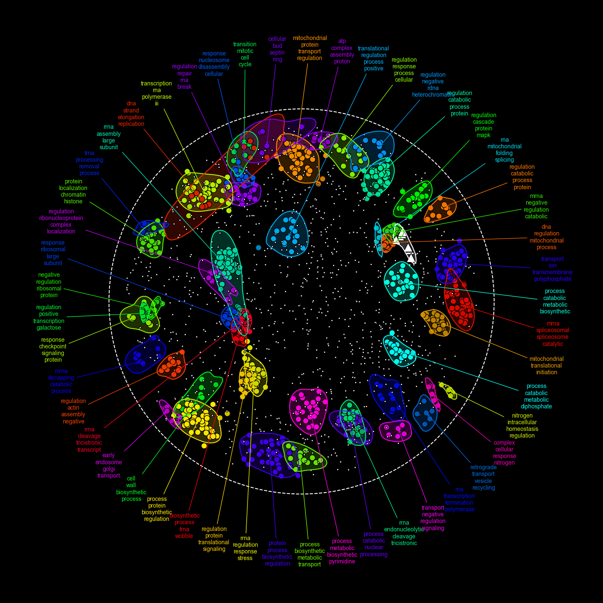

# RISK Examples

This repository contains Jupyter notebooks that demonstrate how to use the **RISK** Python package for biological network analysis. These examples cover various use cases and features of RISK, providing users with practical insights into how to analyze and visualize complex biological networks.

## Features
- Jupyter notebooks with step-by-step tutorials.
- Demonstrations using real-world biological datasets, including the Michaelis 2023 yeast protein-protein interaction (PPI) network.

## Getting Started
Clone this repository and explore the notebooks to see how **RISK** can be applied to your own biological network analysis projects.

## Requirements
- Python 3.8+
- **RISK** package installed with:
  ```bash
  pip install risk-network==0.0.5b5
  ```

## Usage
Simply open the Jupyter notebooks to get started.

## License
This project is licensed under the MIT License.

# RISK-examples Notebook

This notebook, `examples.ipynb`, contains a collection of example scripts demonstrating the use of **RISK**, a Python package designed for biological network analysis. Each example illustrates different features and capabilities of RISK, helping users to explore and analyze biological networks effectively. Whether you're new to RISK or looking to deepen your understanding, these examples will guide you through various use cases and applications.

### Demonstration Using the Yeast PPI Network
In this notebook, we will utilize the comprehensive yeast protein-protein interaction (PPI) network published by Michaelis et al. in 2023. This dataset offers a highly structured interactome of *Saccharomyces cerevisiae*, consisting of 3,927 proteins connected by 31,004 interactions. The network is particularly valuable for exploring complex biological systems and understanding protein interactions at a large scale.

By applying the **RISK** package to this PPI network, we will demonstrate how to perform various analyses, including network clustering, interaction mapping, and identification of key protein complexes. This example will showcase the power of **RISK** in handling and deriving insights from large-scale biological networks.

**Importantly, this specific analysis and demonstration using the yeast PPI network has not been done before.** This makes our exploration both novel and uniquely valuable for researchers working in systems biology and proteomics.


