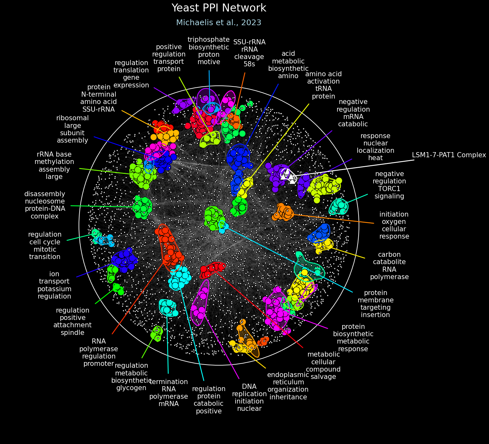

# Visualizing Networks in RISK

Visualization highlights relationships within the network, making modular structure and functional associations easier to interpret. RISK provides a flexible and powerful plotting interface via the `NetworkPlotter` object. This enables generation of publication-ready figures with detailed domain annotations, significance-driven coloring, contours, and rich label customization.

---

## Create a `NetworkPlotter`

You must first load your `NetworkGraph` object into a `NetworkPlotter`.

**Parameters:**

- `graph` (NetworkGraph): The `NetworkGraph` object containing the network structure to be visualized.
- `figsize` (tuple, optional): Size of the figure, specified as a tuple `(width, height)` in inches. Defaults to (10, 10).
- `background_color` (str, list, tuple, or np.ndarray, optional): Background color of the plot. Provide a single color (e.g., `'white'`, `(1.0, 1.0, 1.0)` for RGB, or `(1.0, 1.0, 1.0, 1.0)` for RGBA). Defaults to 'white'.
- `background_alpha` (float, None, optional): Transparency level of the background color. If provided, it overrides any existing alpha values found in `background_color`. Defaults to 1.0.
- `pad` (float, optional): Padding value to adjust the axis limits around the network plot. Defaults to 0.3.

**Returns:**
`NetworkPlotter`: An instance of the plotter initialized with the provided graph and settings.

```python
plotter = risk.load_plotter(
    graph=graph,
    figsize=(15, 15),
    background_color="black",
    background_alpha=1.0,
    pad=0.3,
)
```

---

## plot_title()

Add a title and optional subtitle overlay.

**Parameters:**

- `title` (str, optional): Title of the plot. Defaults to None.
- `subtitle` (str, optional): Subtitle of the plot. Defaults to None.
- `title_fontsize` (int, optional): Font size for the title. Defaults to 20.
- `subtitle_fontsize` (int, optional): Font size for the subtitle. Defaults to 14.
- `font` (str, optional): Font family used for both the title and subtitle. Defaults to "DejaVu Sans".
- `title_color` (str, list, tuple, or np.ndarray, optional): Color of the title text. Provide a single color (e.g., `"black"`, `(0.0, 0.0, 0.0)` for RGB, or `(0.0, 0.0, 0.0, 1.0)` for RGBA). Defaults to "black".
- `title_color` (str, list, tuple, or np.ndarray, optional): Color of the subtitle text. Provide a single color (e.g., `"black"`, `(0.0, 0.0, 0.0)` for RGB, or `(0.0, 0.0, 0.0, 1.0)` for RGBA). Defaults to "black".
- `title_x` (float, optional): X-axis position of the title. Defaults to 0.5.
- `title_y` (float, optional): Y-axis position of the title. Defaults to 0.975.
- `title_space_offset` (float, optional): Fraction of figure height to leave for the space above the plot. Defaults to 0.075.
- `subtitle_offset` (float, optional): Offset factor to position the subtitle below the title. Defaults to 0.025.

```python
plotter.plot_title(
    title="Yeast PPI Network",
    subtitle="Michaelis et al., 2023",
    title_fontsize=24,
    subtitle_fontsize=18,
    font="Arial",
    title_color="white",
    subtitle_color="lightblue",
    title_x=0.5,
    title_y=0.925,
    title_space_offset=0.08,
    subtitle_offset=0.025,
)
```

---

## plot_circle_perimeter()

Draw a circular boundary around the network layout.

**Parameters:**

- `scale` (float, optional): Scaling factor for the perimeter's diameter. Defaults to 1.0.
- `center_offset_x` (float, optional): Horizontal offset as a fraction of the diameter. Negative values shift the center left, positive values shift it right. Defaults to 0.0.
- `center_offset_y` (float, optional): Vertical offset as a fraction of the diameter. Negative values shift the center down, positive values shift it up. Defaults to 0.0.
- `linestyle` (str, optional): Line style for the circle. Options include `"solid"`, `"dashed"`, `"dashdot"`, `"dotted"`, or any Matplotlib-supported linestyle. Defaults to "dashed".
- `linewidth` (float, optional): Width of the circle's outline. Defaults to 1.5.
- `color` (str, list, tuple, or np.ndarray, optional): Color of the circle. Provide a single color (e.g., `"black"`, `(0.0, 0.0, 0.0)` for RGB, or `(0.0, 0.0, 0.0, 1.0)` for RGBA). Defaults to "black".
- `outline_alpha` (float, None, optional): Transparency level for the circle's outline. If provided, it overrides any existing alpha values found in `color`. Defaults to 1.0.
- `fill_alpha` (float, None, optional): Transparency level for the circle’s fill. If provided, it overrides any existing alpha values found in `color`. Defaults to 0.0.

```python
plotter.plot_circle_perimeter(
    scale=1.02,
    center_offset_x=0.0,
    center_offset_y=0.0,
    linestyle="solid",
    linewidth=1.5,
    color="white",
    outline_alpha=1.0,
    fill_alpha=0.0,
)
```

_For a more flexible contour-based layout boundary, see `plot_contour_perimeter()`._

---

## plot_contour_perimeter()

Draw a contour boundary around the network layout.

**Parameters:**

- `scale` (float, optional): Scaling factor for the perimeter size. Defaults to 1.0.
- `levels` (int, optional): Number of contour levels. Defaults to 3.
- `bandwidth` (float, optional): Bandwidth for KDE, controlling the smoothness of the contour. Defaults to 0.8.
- `grid_size` (int, optional): Resolution of the grid for KDE. Higher values create finer contours. Defaults to 250.
- `color` (str, list, tuple, or np.ndarray, optional): Color of the circle. Provide a single color (e.g., `"black"`, `(0.0, 0.0, 0.0)` for RGB, or `(0.0, 0.0, 0.0, 1.0)` for RGBA). Defaults to "black".
- `linestyle` (str, optional): Line style for the contour. Options include `"solid"`, `"dashed"`, `"dashdot"`, `"dotted"`, or any Matplotlib-supported linestyle. Defaults to "solid".
- `linewidth` (float, optional): Width of the contour’s outline. Defaults to 1.5.
- `outline_alpha` (float, None, optional): Transparency level for the contour's outline. If provided, it overrides any existing alpha values found in `color`. Defaults to 1.0.
- `fill_alpha` (float, None, optional): Transparency level for the contour’s fill. If provided, it overrides any existing alpha values found in `color`. Defaults to 0.0.

```python
plotter.plot_contour_perimeter(
    levels=5,
    bandwidth=0.8,
    grid_size=250,
    color="white",
    linestyle="solid",
    linewidth=2.0,
    alpha=1.0,
    fill_alpha=0.2,
)
```

---

## plot_network()

Render nodes and edges with styles derived from significance-aware helpers.

**Parameters:**

- `node_size` (int or np.ndarray, optional): Size of the nodes. Can be a single integer or an array of sizes. Defaults to 50.
- `node_shape` (str, optional): Shape of the nodes. Options include:
  - `'o'`: Circle. _(default)_
  - `'s'`: Square.
  - `'^'`: Triangle up.
  - `'v'`: Triangle down.
  - Other options: `'p'`, `'P'`, `'h'`, `'H'`, `'8'`, `'d'`, `'D'`, `'>'`, `'<`, `'|'`, `'_'`.
- `node_edgewidth` (float, optional): Width of the edges around each node. Defaults to 1.0.
- `edge_width` (float, optional): Width of the edges in the plot. Defaults to 1.0.
- `node_color` (str, list, tuple, or np.ndarray, optional): Color of the nodes. Can be a single color (e.g., `"white"`, `"red"`, `(0.5, 0.5, 0.5)` for RGB, or `(0.5, 0.5, 0.5, 0.8)` for RGBA) or an array of such colors. Defaults to "white".
- `node_edgecolor` (str, list, tuple, or np.ndarray, optional): Color of the edges around each node. Can be a single color, a string of colors, or an array of string or RGB/RGBA colors. Defaults to "black".
- `edge_color` (str, list, tuple, or np.ndarray, optional): Color of the edges connecting the nodes. Can be a single color, a string of colors, or an array of string or RGB/RGBA colors. Defaults to "black".
- `node_alpha` (float or None, optional): Alpha value (transparency) for the nodes. Range: `0.0` (fully transparent) to 1.0`(fully opaque). If provided, it overrides any alpha values in`node_color`. Defaults to 1.0.
- `edge_alpha` (float or None, optional): Alpha value (transparency) for the edges. Range: `0.0` (fully transparent) to 1.0`(fully opaque). If provided, it overrides any alpha values in`edge_color`. Defaults to 1.0.

```python
plotter.plot_network(
    node_size=node_sizes,
    node_color=node_colors,
    node_shape="o",
    node_edgewidth=1.0,
    edge_width=0.03,
    node_edgecolor="black",
    edge_color="white",
    node_alpha=1.0,
    edge_alpha=1.0,
)
```

---

## get_annotated_node_sizes()

Generate node sizes based on annotation significance.

**Parameters:**

- `singificant_size` (int, optional): Size for singificant nodes. Defaults to 50.
- `nonsignificant_size` (int, optional): Size for non-singificant nodes. Defaults to 25.

**Returns:**
`list`: List of node sizes corresponding to graph nodes.

```python
node_sizes = plotter.get_annotated_node_sizes(
    significant_size=225,
    nonsignificant_size=12.5,
)
```

---

## get_annotated_node_colors()

Generate node colors based on annotation significance and optional blending.

**Parameters:**

- `cmap` (str, optional): The colormap to use for node colors. Defaults to "gist_rainbow".
- `color` (str, list, tuple, np.ndarray, or None, optional): A specific color to use for all nodes. Can be a single color (e.g., `"red"`, `(0.5, 0.5, 0.5)` for RGB, or `(0.5, 0.5, 0.5, 0.8)` for RGBA) or an array of such colors. If specified, this will override the colormap (`cmap`). Defaults to None.
- `blend_colors` (bool, optional): Whether to blend colors for nodes with multiple domains. Defaults to False.
- `blend_gamma` (float, optional): Gamma correction factor for perceptual color blending. Defaults to 2.2.
- `min_scale` (float, optional): Minimum scale for color intensity. Defaults to 0.8.
- `max_scale` (float, optional): Maximum scale for color intensity. Defaults to 1.0.
- `scale_factor` (float, optional): Factor for adjusting the color scaling intensity. Defaults to 1.0.
- `alpha` (float, None, optional): Alpha value for singificant nodes. If provided, it overrides any existing alpha values found in `color`. Defaults to 1.0.
- `nonsignificant_color` (str, list, tuple, or np.ndarray, optional): Color for non-singificant nodes. Can be a single color (e.g., `"white"`, `(0.5, 0.5, 0.5)` for RGB, or `(0.5, 0.5, 0.5, 0.8)` for RGBA) or an array of such colors. Defaults to "white".
- `nonsignificant_alpha` (float, None, optional): Alpha value for non-singificant nodes. If provided, it overrides any existing alpha values found in `nonsignificant_color`. Defaults to 1.0.
- `ids_to_colors` (dict, None, optional): Mapping of domain IDs to specific colors. Defaults to None.
- `random_seed` (int, optional): Seed for random number generation. Defaults to 888.

**Returns:**
`list`: List of colors for each node.

```python
node_colors = plotter.get_annotated_node_colors(
    cmap="gist_rainbow",
    color=None,
    blend_colors=False,
    blend_gamma=2.2,
    min_scale=1.0,
    max_scale=1.0,
    scale_factor=0.5,
    alpha=1.0,
    nonsignificant_color="white",
    nonsignificant_alpha=0.75,
    ids_to_colors=None,
    random_seed=887,
)
```

---

## plot_subnetwork()

Overlay a selected group of nodes and their connecting edges with distinct styling.

**Parameters:**

- `nodes` (list, tuple, or np.ndarray): List of node labels to include in the subnetwork. Accepts nested lists.
- `node_size` (int or np.ndarray, optional): Size of the nodes. Can be a single integer or an array of sizes. Defaults to 50.
- `node_shape` (str, optional): Shape of the nodes. Options include:
  - `'o'`: Circle. _(default)_
  - `'s'`: Square.
  - `'^'`: Triangle up.
  - `'v'`: Triangle down.
  - Other options: `'p'`, `'P'`, `'h'`, `'H'`, `'8'`, `'d'`, `'D'`, `'>'`, `'<`, `'|'`, `'_'`.
- `node_edgewidth` (float, optional): Width of the node edges. Defaults to 1.0.
- `edge_width` (float, optional): Width of the edges in the subnetwork plot. Defaults to 1.0.
- `node_color` (str, list, tuple, or np.ndarray, optional): Color of the nodes. Can be a single color (e.g., `"red"`, `(0.5, 0.5, 0.5)` for RGB, or `(0.5, 0.5, 0.5, 0.8)` for RGBA) or an array of such colors. Defaults to "white".
- `node_edgecolor` (str, list, tuple, or np.ndarray, optional): Color of the node edges. Can be a single color or an array of string or RGB/RGBA colors. Defaults to "black".
- `edge_color` (str, list, tuple, or np.ndarray, optional): Color of the edges connecting the nodes. Can be a single color or an array of string or RGB/RGBA colors. Defaults to "black".
- `node_alpha` (float or None, optional): Transparency for the nodes. Range: `0.0` (fully transparent) to `1.0` (fully opaque). If provided, it overrides any alpha values in `node_color`. Defaults to None.
- `edge_alpha` (float or None, optional): Transparency for the edges. Range: `0.0` (fully transparent) to `1.0` (fully opaque). If provided, it overrides any alpha values in `edge_color`. Defaults to None.

```python
plotter.plot_subnetwork(
    nodes=[
        "LSM1", "LSM2", "LSM3", "LSM4", "LSM5", "LSM6", "LSM7", "PAT1",
    ],
    node_size=225,
    node_shape="^",
    node_edgewidth=1.0,
    edge_width=0.04,
    node_color="white",
    node_edgecolor="black",
    edge_color="white",
    node_alpha=1.0,
    edge_alpha=1.0,
)
```

---

## plot_contours()

Draw contours for domains (e.g., GO term regions).

**Parameters:**

- `levels` (int, optional): Number of contour levels to plot. Defaults to 5.
- `bandwidth` (float, optional): Bandwidth for KDE, controlling the smoothness of the contour. Defaults to 0.8.
- `grid_size` (int, optional): Resolution of the grid for KDE. Higher values create finer contours. Defaults to 250.
- `color` (str, list, tuple, or np.ndarray, optional): Color of the contours. Can be a string (e.g., `"white"`), an RGB/RGBA value, or an array of such values. Defaults to "white".
- `linestyle` (str, optional): Line style for the contours. Options include `'solid'`, `'dashed'`, `'dashdot'`, `'dotted'. Defaults to "solid".
- `linewidth` (float, optional): Line width for the contours. Defaults to 1.5.
- `alpha` (float, None, optional): Transparency level of the contour lines. Range: `0.0` (fully transparent) to `1.0` (fully opaque). If provided, it overrides any existing alpha values found in `color`. Defaults to 1.0.
- `fill_alpha` (float, None, optional): Transparency level of the contour fill. If provided, it overrides any existing alpha values found in `color`. Defaults to None.

```python
plotter.plot_contours(
    levels=5,
    bandwidth=0.8,
    grid_size=250,
    color=plotter.get_annotated_contour_colors(
        cmap="gist_rainbow",
        color=None,
        blend_colors=False,
        blend_gamma=2.2,
        min_scale=1.0,
        max_scale=1.0,
        scale_factor=0.5,
        ids_to_colors=None,
        random_seed=887,
    ),
    linestyle="solid",
    linewidth=2.0,
    alpha=1.0,
    fill_alpha=0.2,
)
```

---

## get_annotated_contour_colors()

Generate colors for domain contours based on annotation significance.

**Parameters:**

- `cmap` (str, optional): The colormap to use for contour colors. Defaults to "gist_rainbow".
- `color` (str, list, tuple, np.ndarray, or None, optional): A specific color to use for all contours. Can be a string (e.g., `"red"`), an RGB or RGBA value, or an array of such values (strings, RGB, or RGBA). If specified, this will overwrite the colormap (`cmap`). Defaults to None.
- `blend_colors` (bool, optional): Whether to blend colors for nodes with multiple domains. Defaults to False.
- `blend_gamma` (float, optional): Gamma correction factor for perceptual color blending. Defaults to 2.2.
- `min_scale` (float, optional): Minimum intensity scale for the colors generated by the colormap. Controls the dimmest colors. Defaults to 0.8.
- `max_scale` (float, optional): Maximum intensity scale for the colors generated by the colormap. Controls the brightest colors. Defaults to 1.0.
- `scale_factor` (float, optional): Exponent for adjusting color scaling based on significance scores. A higher value increases contrast by dimming lower scores more. Defaults to 1.0.
- `ids_to_colors` (dict, None, optional): Mapping of domain IDs to specific colors. Defaults to None.
- `random_seed` (int, optional): Seed for random number generation to ensure reproducibility. Defaults to 888.

**Returns:**
`list`: List of colors for each domain contour.

```python
contour_colors = plotter.get_annotated_contour_colors(
    cmap="gist_rainbow",
    color=None,
    blend_colors=False,
    blend_gamma=2.2,
    min_scale=1.0,
    max_scale=1.0,
    scale_factor=0.5,
    ids_to_colors=None,
    random_seed=887,
)
```

---

## plot_subcontour()

Draw a contour around a subset of nodes.

**Parameters:**

- `nodes` (list, tuple, or np.ndarray): List of node labels or list of lists of node labels to plot the contour for.
- `levels` (int, optional): Number of contour levels to plot. Defaults to 5.
- `bandwidth` (float, optional): Bandwidth for KDE, controlling the smoothness of the contour. Defaults to 0.8.
- `grid_size` (int, optional): Resolution of the grid for KDE. Higher values create finer contours. Defaults to 250.
- `color` (str, list, tuple, or np.ndarray, optional): Color of the contour. Can be a string (e.g., `"white"`), an RGB or RGBA value, or an array of such values (strings, RGB, or RGBA). Defaults to "white".
- `linestyle` (str, optional): Line style for the contour. Options include `'solid'`, `'dashed'`, `'dashdot'`, `'dotted'`. Defaults to "solid".
- `linewidth` (float, optional): Line width for the contour. Defaults to 1.5.
- `alpha` (float, None, optional): Transparency level of the contour lines. Range: `0.0` (fully transparent) to 1.0`(fully opaque). If provided, it overrides any existing alpha values found in`color`. Defaults to 1.0.
- `fill_alpha` (float, None, optional): Transparency level of the contour fill. If provided, it overrides any existing alpha values found in `color`. Defaults to None.

```python
plotter.plot_subcontour(
    nodes=[
        "LSM1", "LSM2", "LSM3", "LSM4", "LSM5", "LSM6", "LSM7", "PAT1",
    ],
    levels=5,
    bandwidth=0.8,
    grid_size=250,
    color="white",
    linestyle="solid",
    linewidth=2.0,
    alpha=1.0,
    fill_alpha=0.25,
)
```

---

## plot_labels()

Annotate selected nodes or domains with styled text and arrows.

**Parameters:**

- `scale` (float, optional): Scale factor for positioning labels around the perimeter. Defaults to 1.05.
- `offset` (float, optional): Offset distance for labels from the perimeter. Defaults to 0.10.
- `font` (str, optional): Font name for the labels. Defaults to "DejaVu Sans".
- `fontcase` (str, dict, or None, optional): Defines how to transform the case of words. Can be a string (`'upper'`, `'lower'`, `'title'`) or a dictionary mapping cases (e.g., `{'lower': 'title', 'upper': 'lower'}`). Defaults to None.
- `fontsize` (int, optional): Font size for the labels. Defaults to 10.
- `fontcolor` (str, list, tuple, or np.ndarray, optional): Color of the label text. Can be a string (e.g., `"black"`), an RGB or RGBA value, or an array of such values (strings, RGB, or RGBA). Defaults to "black".
- `fontalpha` (float, None, optional): Transparency level for the font color. Range: `0.0` (fully transparent) to `1.0` (fully opaque). If provided, it overrides any existing alpha values found in `fontcolor`. Defaults to 1.0.
- `arrow_linewidth` (float, optional): Line width of the arrows pointing to centroids. Defaults to 1.
- `arrow_style` (str, optional): Style of the arrows pointing to centroids. Defaults to "->".
- `arrow_color` (str, list, tuple, or np.ndarray, optional): Color of the arrows. Can be a string (e.g., `"black"`), an RGB or RGBA value, or an array of such values (strings, RGB, or RGBA). Defaults to "black".
- `arrow_alpha` (float, None, optional): Transparency level for the arrow color. Range: `0.0` (fully transparent) to `1.0` (fully opaque). If provided, it overrides any existing alpha values found in `arrow_color`. Defaults to 1.0.
- `arrow_base_shrink` (float, optional): Distance between the text and the base of the arrow. Defaults to 0.0.
- `arrow_tip_shrink` (float, optional): Distance between the arrow tip and the centroid. Defaults to 0.0.
- `max_labels` (int, optional): Maximum number of labels to plot. Defaults to None` (no limit.
- `min_label_lines` (int, optional): Minimum number of lines in a label. Defaults to 1.
- `max_label_lines` (int, optional): Maximum number of lines in a label. Defaults to None` (no limit.
- `min_chars_per_line` (int, optional): Minimum number of characters in a line to display. Defaults to 1.
- `max_chars_per_line` (int, optional): Maximum number of characters in a line to display. Defaults to None (no limit).
- `words_to_omit` (list, optional): List of words to omit from the labels. Defaults to None.
- `overlay_ids` (bool, optional): Whether to overlay domain IDs in the center of the centroids. Defaults to False.
- `ids_to_keep` (list, tuple, np.ndarray, or None, optional): IDs of domains that must be labeled. To discover domain IDs, you can set `overlay_ids=True`. Defaults to None.
- `ids_to_labels` (dict, optional): A dictionary mapping domain IDs to custom labels (strings). The labels should be space-separated words. If provided, the custom labels will replace the default domain terms. Defaults to None.

```python
plotter.plot_labels(
    scale=1.1,
    offset=0.12,
    font="Arial",
    fontcase={"title": "lower"},
    fontsize=15,
    fontcolor="white",
    fontalpha=1.0,
    arrow_linewidth=2.0,
    arrow_style="-",
    arrow_color=plotter.get_annotated_label_colors(
        cmap="gist_rainbow",
        color=None,
        blend_colors=False,
        blend_gamma=2.2,
        min_scale=1.0,
        max_scale=1.0,
        scale_factor=0.5,
        ids_to_colors=None,
        random_seed=887,
    ),
    arrow_alpha=1.0,
    arrow_base_shrink=10.0,
    arrow_tip_shrink=0.0,
    max_labels=28,
    min_label_lines=3,
    max_label_lines=4,
    min_chars_per_line=3,
    max_chars_per_line=12,
    words_to_omit=["from", "the", "into", "via", "novo", "process", "activity"],
    overlay_ids=False,
    ids_to_keep=None,
    ids_to_labels=None,
)
```

---

## get_annotated_label_colors()

Generate colors for labels based on annotation significance.

**Parameters:**

- `cmap` (str, optional): The colormap to use for label colors. Defaults to "gist_rainbow".
- `color` (str, list, tuple, np.ndarray, or None, optional): A specific color to use for all labels. Can be a string (e.g., `"red"`), an RGB or RGBA value, or an array of such values (strings, RGB, or RGBA). Warning: If specified, this will overwrite the colormap (`cmap`). Defaults to None.
- `blend_colors` (bool, optional): Whether to blend colors for nodes with multiple domains. Defaults to False.
- `blend_gamma` (float, optional): Gamma correction factor for perceptual color blending. Defaults to 2.2.
- `min_scale` (float, optional): Minimum intensity scale for the colors generated by the colormap. Controls the dimmest colors. Defaults to 0.8.
- `max_scale` (float, optional): Maximum intensity scale for the colors generated by the colormap. Controls the brightest colors. Defaults to 1.0.
- `scale_factor` (float, optional): Exponent for adjusting color scaling based on significance scores. A higher value increases contrast by dimming lower scores more. Defaults to 1.0.
- `ids_to_colors` (dict, None, optional): Mapping of domain IDs to specific colors. Defaults to None.
- `random_seed` (int, optional): Seed for random number generation to ensure reproducibility. Defaults to 888.

**Returns:**
`list`: List of colors for each label.

```python
label_colors = plotter.get_annotated_label_colors(
    cmap="gist_rainbow",
    color=None,
    blend_colors=False,
    blend_gamma=2.2,
    min_scale=1.0,
    max_scale=1.0,
    scale_factor=0.5,
    ids_to_colors=None,
    random_seed=887,
)
```

---

## plot_sublabel()

Add a single label tied to a chosen set of nodes (arrow points to centroid). Useful for naming complexes or pathway modules.

**Parameters:**

- `nodes` (list, tuple, or np.ndarray): List of node labels or list of lists of node labels to be used for calculating the centroid.
- `label` (str): The label to be annotated on the network.
- `radial_position` (float, optional): Radial angle for positioning the label around the network's perimeter. Range: `0-360` degrees. Defaults to 0.0.
- `scale` (float, optional): Scale factor for positioning the label around the perimeter. Defaults to 1.05.
- `offset` (float, optional): Offset distance for the label from the perimeter. Defaults to 0.10.
- `font` (str, optional): Font name for the label. Defaults to "DejaVu Sans".
  - Options: Any valid font name (e.g., `"DejaVu Sans"`, `"Times New Roman"`).
- `fontsize` (int, optional): Font size for the label. Defaults to 10.
  - Options: Any integer value representing font size.
- `fontcolor` (str, list, tuple, or np.ndarray, optional): Color of the label text. Can be a string (e.g., `"black"`), an RGB or RGBA value, or an array of such values. Defaults to "black".
- `fontalpha` (float, None, optional): Transparency level for the label font. Range: `0.0` (fully transparent) to `1.0` (fully opaque). If provided, it overrides any existing alpha values found in `fontcolor`. Defaults to 1.0.
- `arrow_linewidth` (float, optional): Line width of the arrow pointing to the centroid. Defaults to 1.
- `arrow_style` (str, optional): Style of the arrows pointing to the centroid. Defaults to "->".
- `arrow_color` (str, list, tuple, or np.ndarray, optional): Color of the arrow. Can be a string, RGB/RGBA value, or an array of such values. Defaults to "black".
- `arrow_alpha` (float, None, optional): Transparency level for the arrow. Range: `0.0` (fully transparent) to `1.0` (fully opaque). If provided, it overrides any existing alpha values found in `arrow_color`. Defaults to 1.0.
- `arrow_base_shrink` (float, optional): Distance between the text and the base of the arrow. Defaults to 0.0.
- `arrow_tip_shrink` (float, optional): Distance between the arrow tip and the centroid. Defaults to 0.0.

```python
plotter.plot_sublabel(
    nodes=[
        "LSM1", "LSM2", "LSM3", "LSM4", "LSM5", "LSM6", "LSM7", "PAT1",
    ],
    label="LSM1-7-PAT1 Complex",
    radial_position=73,
    scale=1.6,
    offset=0.12,
    font="Arial",
    fontsize=15,
    fontcolor="white",
    fontalpha=1.0,
    arrow_linewidth=2.0,
    arrow_style="-",
    arrow_color="white",
    arrow_alpha=1.0,
    arrow_base_shrink=10.0,
    arrow_tip_shrink=0.0,
)
```

---

## savefig()

Save the current figure to file in formats like PNG, SVG, or PDF.

**Parameters:**

- `*args`: Positional arguments passed to `plt.savefig`. Commonly used for specifying the filename (e.g., `"plot.png"`).
- `pad_inches` (float, optional): Padding around the figure when saving. Defaults to 0.5.
- `dpi` (int, optional): Dots per inch (DPI) for the exported image. Defaults to 100.
- `**kwargs`: Keyword arguments passed to `plt.savefig`, such as `format` (e.g., `"png"`, `"pdf"`) and other options like `bbox_inches`.

```python
plotter.savefig("my_plot.png", pad_inches=0.5, dpi=100)
```

---

## show()

Display the current figure inline or in a graphical window.

**Parameters:**

- `*args`: Positional arguments passed to `plt.show`. Typically not used, but can be included for consistency.
- `**kwargs`: Keyword arguments passed to `plt.show`, such as `block` to control whether the display blocks the execution of code.

```python
plotter.show()
```

---



---

## Next Step

[Overview of `risk.params`](7_parameters.md)
