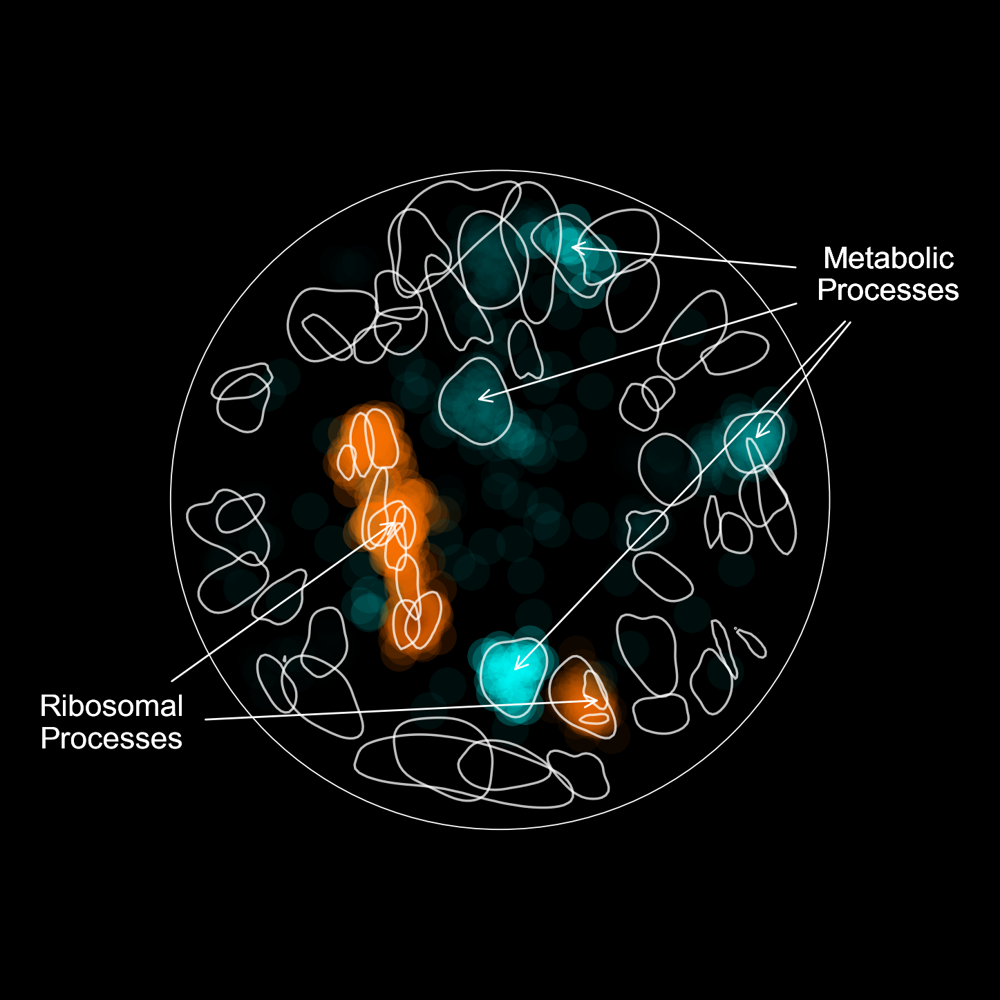

# Advanced Plotting

Once you're familiar with RISK’s core plotting methods, you can begin layering multiple annotations, subnetworks, and styles to highlight specific biological themes. This section walks through advanced plotting features using a real-world example.

---

## Use Case: Dual Overlay of Coexpression Subgroups

In this example, we highlight two functionally distinct sets of genes:
- Highly coexpressed nodes
- Weakly coexpressed nodes

We annotate each with a distinct color and size overlay, draw the global network structure, and apply clear labeling for biological interpretation.

---

## Step 1: Define Your Subgroups

Use lists of node names to define subgroups of interest.

```python
high_coexpression_nodes = ["RPL1A", "RPL2B", "RPL3", "RPL5"]
low_coexpression_nodes = ["YGR103W", "YDL064W", "YML082W", "YOR204W"]
```

---

## Step 2: Initialize the Plotter

We create a new `NetworkPlotter` instance and set background preferences.

```python
plotter = risk.load_plotter(
    graph=graph,
    figsize=(16, 16),
    background_color="black",
    background_alpha=1.0,
    pad=0.3,
)
```

---

## Step 3: Draw the Full Network and Frame

```python
plotter.plot_network(
    node_colors=plotter.get_annotated_node_colors(),
    node_sizes=plotter.get_annotated_node_sizes(),
)
plotter.plot_circle_perimeter(
    radius=1.0,
    color="white",
    linewidth=2.0,
    linestyle="solid",
    alpha=1.0,
)
```

---

## Step 4: Highlight Subnetworks

Overlay the high and low coexpression groups in distinct styles.

```python
plotter.plot_subnetwork(
    nodes=high_coexpression_nodes,
    color="lime",
    size=225,
    alpha=1.0,
)

plotter.plot_subnetwork(
    nodes=low_coexpression_nodes,
    color="magenta",
    size=225,
    alpha=1.0,
)
```

---

## Step 5: Add KDE Domain Contours

Highlight enriched domains using KDE-based clustering.

```python
plotter.plot_contours(
    levels=5,
    grid_size=250,
    color=plotter.get_annotated_contour_colors(),
    alpha=1.0,
    fill_alpha=0.25,
)
```

---

## Step 6: Annotate Regions with Sublabels

Draw manual labels and arrows pointing to known complexes or pathways.

```python
plotter.plot_sublabel(
    nodes=high_coexpression_nodes,
    label="High Coexpression (Ribosomal)",
    radial_position=45,
    scale=1.8,
    offset=0.12,
    fontcolor="lime",
    fontsize=16,
)

plotter.plot_sublabel(
    nodes=low_coexpression_nodes,
    label="Low Coexpression (Metabolic)",
    radial_position=190,
    scale=1.8,
    offset=0.12,
    fontcolor="magenta",
    fontsize=16,
)
```

---

## Use Case: Highlighting Party Hubs and Date Hubs

In this advanced example, we visualize **party hubs** and **date hubs** based on coexpression scores from the SPELL database. We use precomputed color mappings for each subgroup and annotate regions of the network linked to ribosomal and metabolic functions.

### Step 1: Load and Plot Colored Subnetworks

```python
import json

def load_json_to_dict(filepath):
    with open(filepath, "r") as file:
        return json.load(file)

high_rgba = load_json_to_dict("./data/json/coexpression/high_coexpression_michaelis_2023.json")
low_rgba = load_json_to_dict("./data/json/coexpression/low_coexpression_michaelis_2023.json")

high_nodes, high_colors = zip(*high_rgba.items())
low_nodes, low_colors = zip(*low_rgba.items())

plotter = risk.load_plotter(graph=graph, figsize=(15, 15), background_color="black")

plotter.plot_subnetwork(nodes=high_nodes, node_size=1500, node_color=high_colors, edge_width=0)
plotter.plot_subnetwork(nodes=low_nodes, node_size=1500, node_color=low_colors, edge_width=0)
plotter.plot_contours(color="white", alpha=0.75, linewidth=2.5)
```

### Step 2: Annotate Ribosomal and Metabolic Domains

Use domain IDs (discovered via `plot_labels(overlay_ids=True)`) to retrieve node labels for key pathways.

```python
def get_labels(domain_ids):
    if not isinstance(domain_ids, (list, tuple)):
        domain_ids = [domain_ids]
    return sum([graph.domain_id_to_node_labels_map[d] for d in domain_ids], [])

ribosome_nodes = get_labels([69, 72, 28, 79])
metabolism_nodes = get_labels([16, 18, 41, 99])

plotter.plot_sublabel(nodes=ribosome_nodes, label="Ribosomal\nProcesses", radial_position=240)
plotter.plot_sublabel(nodes=metabolism_nodes, label="Metabolic\nProcesses", radial_position=60)
plotter.show()
```

This overlay highlights the spatial and functional separation of coexpression-based hub classes in the yeast interactome.

---

## Final Output

Display or save the composite figure.

```python
plotter.savefig("advanced_plot.svg", dpi=300)
plotter.show()
```



---

## Recap: What You Learned

- How to highlight custom biological subgroups  
- How to blend annotation significance with custom overlays  
- How to label specific domains using radial positioning  
- How to layer multiple visual features for storytelling

---

## Next Step

Explore example notebooks or [Parameter Reference](./8_parameters.md) for a complete list of available options.
