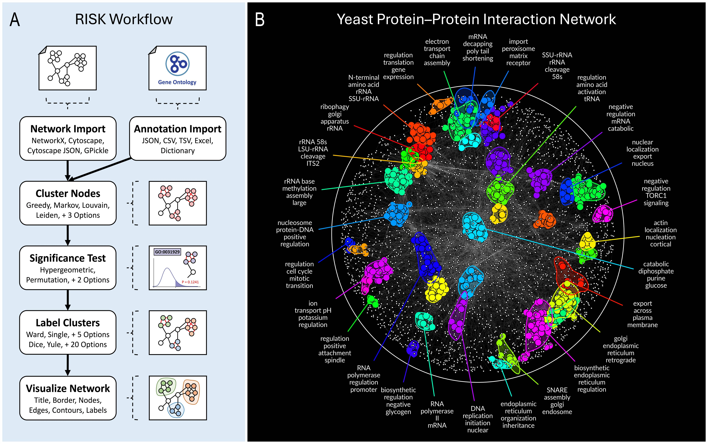

# Welcome to RISK Network Documentation

**RISK** (Regional Inference of Significant Kinships) is a modular, scalable tool for biological network annotation and visualization. It integrates community detection, rigorous statistical testing, and high-resolution visualization in a single streamlined framework.

These docs guide you through installation, usage, and advanced features.

## Getting Started

Begin here for setup and core concepts:

- [0. Introduction](0_introduction.md): Overview of RISK and key principles
- [1. Installation](1_installation.md): Install RISK on your system

Interactive tutorials:

- <a href="https://mybinder.org/v2/gh/riskportal/network-tutorial/HEAD?filepath=notebooks/quickstart.ipynb" target="_blank" rel="noopener">Launch Quickstart in Binder</a> (no installation required)
- [Full Tutorial (HTML)](tutorial.html)
- [Download Tutorial + Data (ZIP)](tutorial.zip)

## Core Features

- [2. Network Input](2_network_input.md)
- [3. Annotation Input](3_annotation_input.md)
- [4. Clustering & Statistics](4_clustering_statistics.md)
- [5. Graph Setup](5_graph_setup.md)
- [6. Visualization](6_visualization.md)
- [7. Parameters](7_parameters.md)

---

For interactive examples, use [tutorial.zip](tutorial.zip) in Jupyter or view the [static HTML version](tutorial.html).

Contributions are welcome on [GitHub](https://github.com/riskportal/network-tutorial).
Explore the [RISK source code](https://github.com/riskportal/network).
